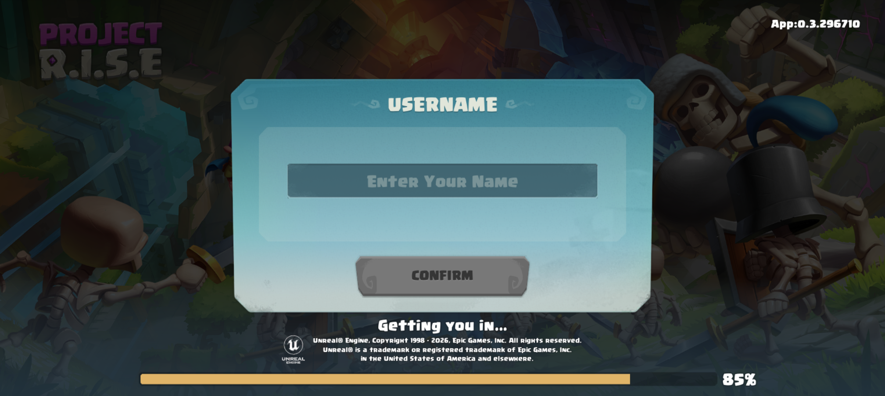
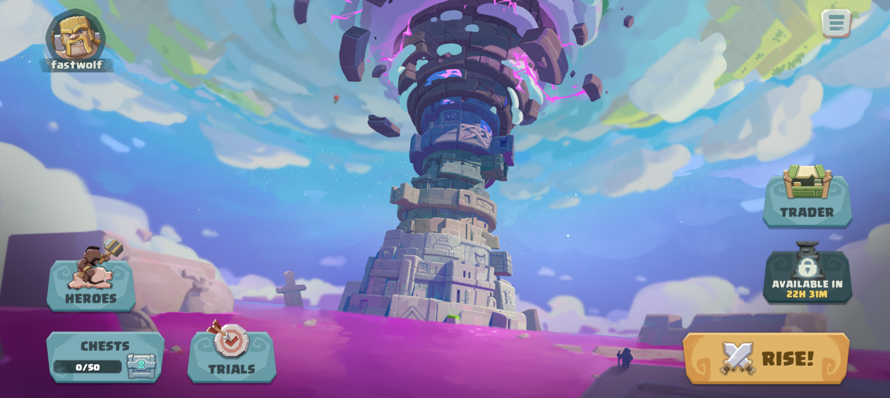
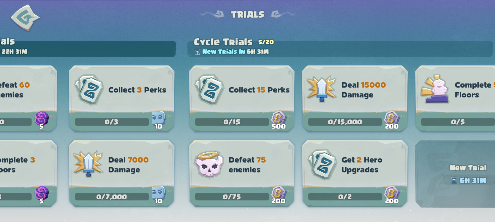

# Project D.R.O.P
This is the first ever private server for the Project R.I.S.E<br>
This private server runs on game version v0.3.296710<br>
This project was written in C++ with using "asio" networking library from scratch in 2 days by fastwolf (me)<br>

For now, project only contains full login flow (which was kinda annoying to write), and because of that you can play in login screen<br>
I needed to publish this as soon as possible, that's why code quality in this project isn't perfect at some point.

# How to use
First of all, this project is using an .env file for sensitive data, and before launching server you need to to open file which is in **Supercell.Slash.Server/Config/.env.example**<br>
Then, you need to include actual keys for this version, otherwise server isn't gonna work, then you need to rename file **.env.example** to **.env** (that was made to avoid any .env files leak)<br>
Second, this project includes asio library, and on linux you can download this library like
```sh
sudo apt install libasio-dev
```
Then extract installed asio library, and update your installed library path in start.sh, and you are done<br>
Enjoy launching it

# About client
In this repository won't be an tutorial how to make an client, i wish that you all are already know how to do it, if u really want to launch it.

## Screenshots in-game

Login in-game screen

Lobby in-game screen

Quests in-game screen

# Questions
If you have any question about server, you can direct message me<br>
On discord: fastdevlid
